## 启动页

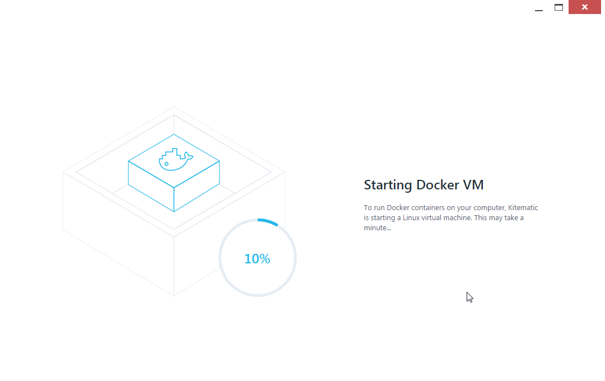

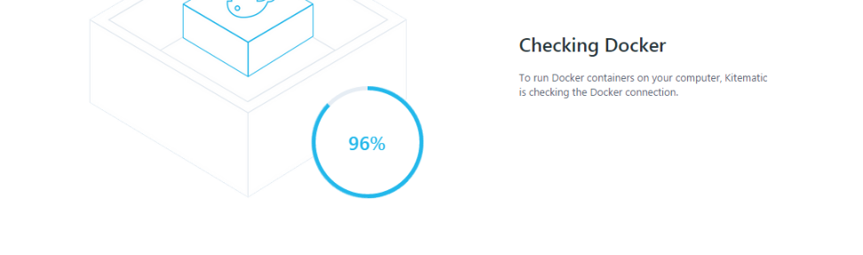

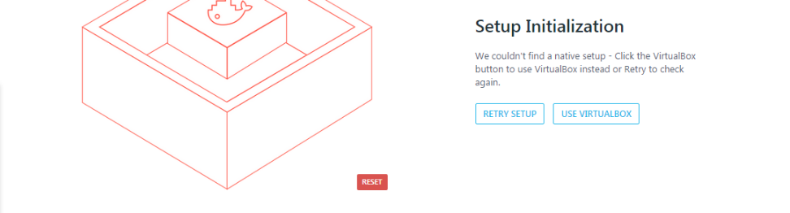

| en                                                           | cn                                                           |
| ------------------------------------------------------------ | ------------------------------------------------------------ |
| Starting Docker VM                                           | 开启Docker 虚拟机                                            |
| To run Docker containers on your computer,Kitematic is starting a Linux virtual machine. This may take a minute… | 运行Docker容器在你的计算机， Kitematic正在启动一个Linux虚拟机。 这可能需要一分钟… |
| Checking Docker                                              | 检查 Docker                                                  |
| To run Docker containers on your computer,Kitematic is checking the Docker connection | 运行Docker容器在你的计算机， Kitematic正在检查 Docker 连接   |
| Setup Initialization                                         | 设置初始化 [^2]                                              |
| We couldn’t find a native setup - Click the VirtualBox button to use VirtualBox instead or Retry to check again. | 我们找不到本地设置，单击VirtualBox按钮使用VirtualBox代替或重试再次检查。 |
| RETRY SETUP                                                  | 重试设置                                                     |
| USE  VIRTUALBOX                                              | 使用VirtualBox                                               |
| RESET                                                        | 重置                                                         |

## 主界面

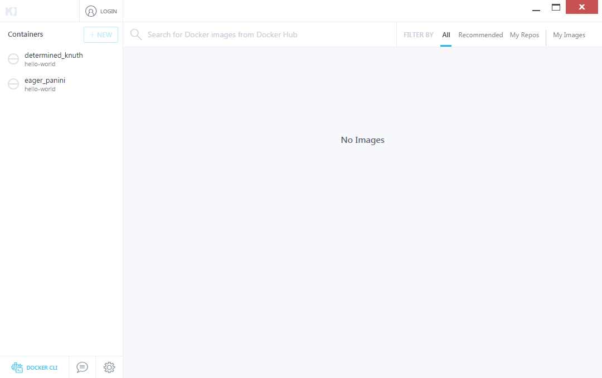

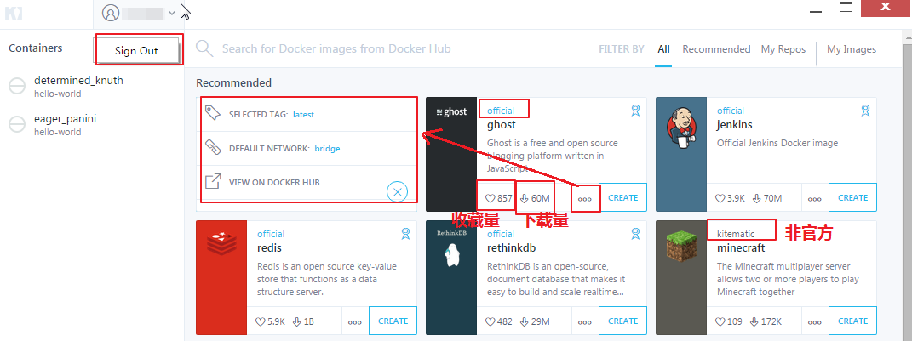

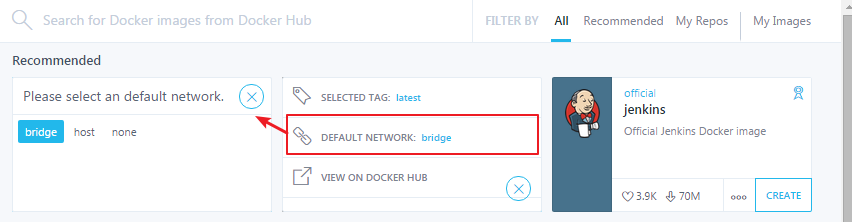

| en                                       | cn                           |
| ---------------------------------------- | ---------------------------- |
| Containers                               | 容器                         |
| LOGIN                                    | 登录                         |
| NEW                                      | 新建                         |
| DOCKER CLI                               | Docker命令行                 |
| Search for Docker images from Docker Hub | 搜索Docker映像来自Docker Hub |
| FILTER BY                                | 过滤                         |
| ALL                                      | 所有                         |
| Recommended                              | 推荐                         |
| My Repos                                 | 我的仓库                     |
| My Images                                | 我的映像                     |
| No  Images                               | 没有映像                     |
| Sign Out                                 | 登出                         |
| SELECTED TAG                             | 选择标签                     |
| DEFAULT NETWORK                          | 默认网络                     |
| VIEW ON DOCKER HUB                       | 显示在 Docker Hub            |
| official                                 | 官方                         |
| Please select an default network.        | 请选择一个默认网络           |
| bridge                                   | 桥接                         |
| host                                     | 主机                         |
| none                                     | 无                           |

### My Repos

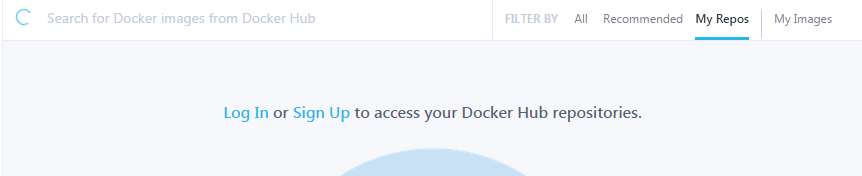

| en                                                       | cn                                 |
| -------------------------------------------------------- | ---------------------------------- |
| Log In or Sign Up to access your Docker Hub repositories | 登录或注册访问你的 Docker Hub 仓库 |

### My  Images

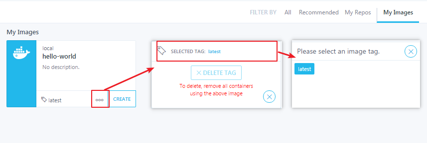

| en                                                    | cn                               |
| ----------------------------------------------------- | -------------------------------- |
| My Images                                             | 我的映像                         |
| local                                                 | 本地                             |
| No description                                        | 无描述                           |
| CREATE                                                | 创建                             |
| SELECTED TAG                                          | 选择标签                         |
| DELETE TAG                                            | 删除标签                         |
| To delete,remove all containers using the above image | 删除，移除所有容器使用上面的图像 |
| Please select an image tag.                           | 请选择一个映像标签               |
|                                                       |                                  |

## 设置页

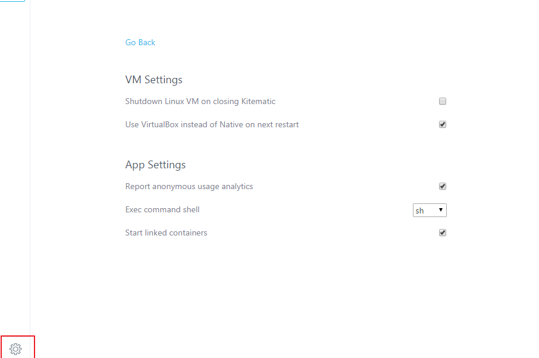

| en                                               | cn                                         |
| ------------------------------------------------ | ------------------------------------------ |
| Go Back                                          | 返回                                       |
| VM Settings                                      | 虚拟机设置                                 |
| Shutdown Linux VM on closing  Kitematic          | 关闭Linux虚拟机当关闭 Kitematic 时         |
| Use VirtualBox instead of Native on next restart | 使用VirtualBox替代本地的在下一次重启时[^1] |
| App Settings                                     | 应用程序设置                               |
| Report anonymous usage analytics                 | 匿名报告使用情况分析                       |
| Exec command shell                               | 执行命令的shell                            |
| Start linked containers                          | 开始连接容器                               |

## 登录页

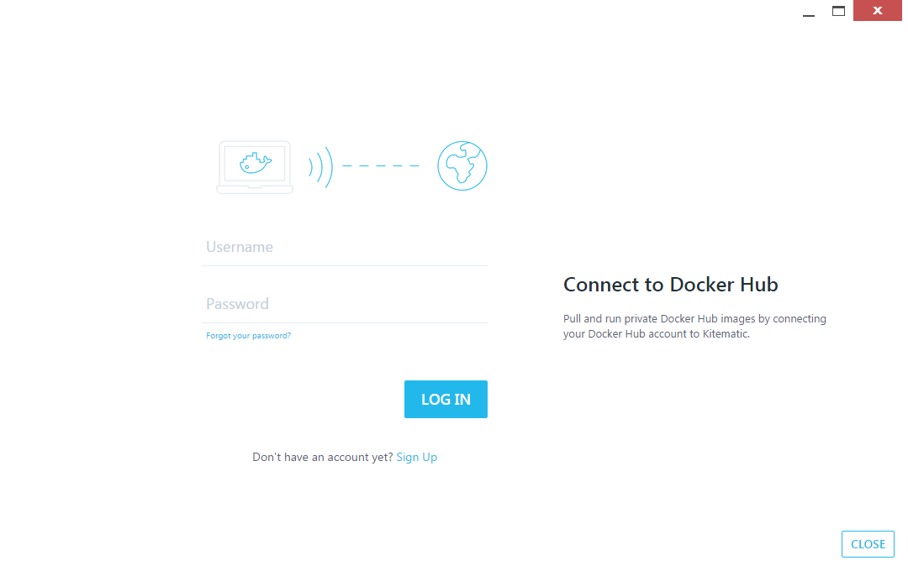

| en                                                           | cn                                                           |
| ------------------------------------------------------------ | ------------------------------------------------------------ |
| Username                                                     | 用户名                                                       |
| Password                                                     | 密码                                                         |
| Forgot your password?                                        | 忘记你的密码了吗？                                           |
| LOG IN                                                       | 登录                                                         |
| Don’t have an account yet? Sign Up                           | 还没有一个帐户了吗?注册                                      |
| Connect to Docker Hub                                        | 连接到 Docker Hub                                            |
| Pull and run private Docker Hub images by connecting your Docker Hub  account to Kitematic. | 拉取并运行私有Docker Hub 映像到 Kitematic  通过连接到你的 Docker Hub 账户 |
| CLOSE                                                        | 关闭                                                         |

## 容器页

### 主页

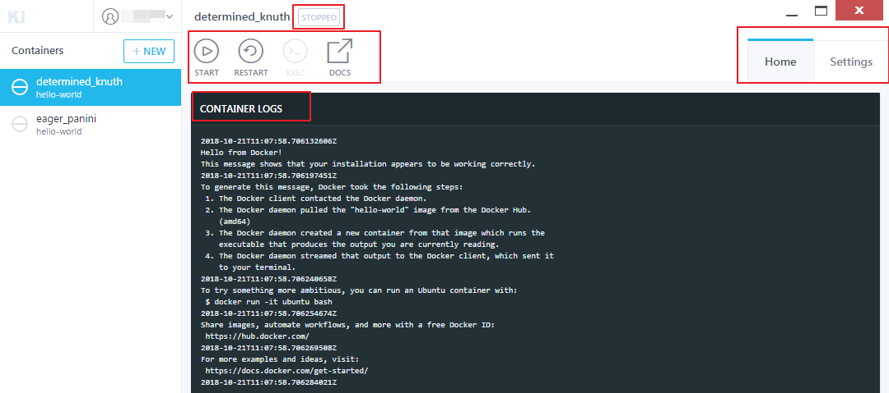

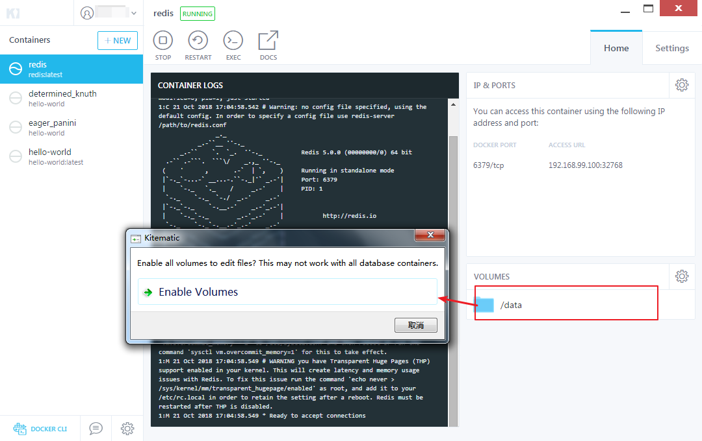

| en                                                           | cn                                                 |
| ------------------------------------------------------------ | -------------------------------------------------- |
| STOPPED                                                      | 停止的                                             |
| RUNNING                                                      | 运行中                                             |
| DOWNLOADING                                                  | 下载中                                             |
| START                                                        | 启动                                               |
| STOP                                                         | 停止                                               |
| RESTART                                                      | 重启                                               |
| EXEC                                                         | 执行                                               |
| DOCS                                                         | 文档                                               |
| Home                                                         | 主页                                               |
| Settings                                                     | 设置                                               |
| CONTAINER LOGS                                               | 容器日志                                           |
| IP&PORTS                                                     | IP & 端口                                          |
| You can access this container using the following IP address and port | 您可以访问这个容器使用下面的IP地址和端口           |
| DOCKER PORT                                                  | Docker 端口                                        |
| ACCESS URL                                                   | 访问 URL                                           |
| VOLUMES                                                      | 卷                                                 |
| Enable all volumes to edit files? This may not work with all database containers. | 允许所有卷编辑文件? 这可能不适用于所有数据库容器。 |
| Enable Volumes                                               | 启用卷   |

### 设置

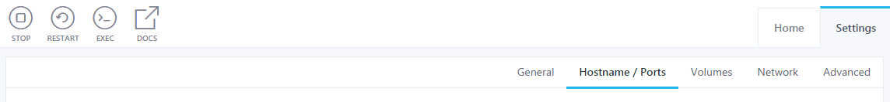

| en             | cn          |
| -------------- | ----------- |
| General        | 一般        |
| Hostname/Ports | 主机名/端口 |
| Volumes        | 卷          |
| Network        | 网络        |
| Advanced       | 高级        |

#### General

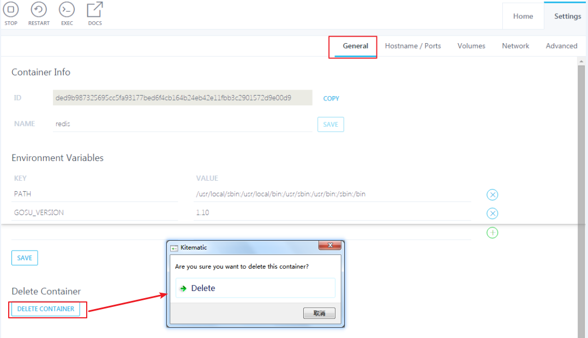

| en                                              | cn                         |
| ----------------------------------------------- | -------------------------- |
| Container Info                                  | 容器信息                   |
| COPY                                            | 复制                       |
| NAME                                            | 名称                       |
| SAVE                                            | 保存                       |
| Environment Variables                           | 环境变量                   |
| KEY                                             | 键                         |
| VALUE                                           | 值                         |
| SAVE                                            | 保存                       |
| Delete Container                                | 删除容器                   |
| DELETE CONTAINER                                | 删除容器                   |
| Are you sure you want to delete this container? | 你确定你要删除这个容器吗？ |
| Delete                                          | 删除                       |

#### Hostname/Ports

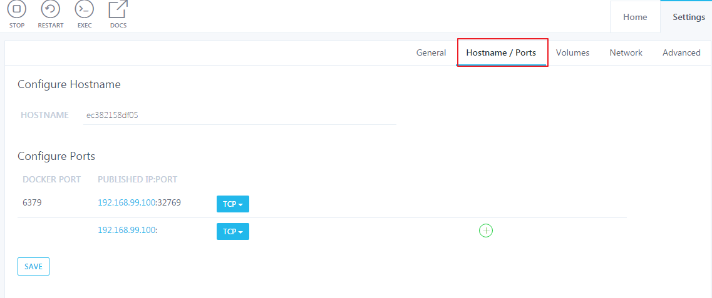

| en                 | cn            |
| ------------------ | ------------- |
| Configure Hostname | 配置主机名    |
| HOSTNAME           | 主机名        |
| Configure Ports    | 配置端口      |
| DOCKER PORT        | Docker 端口   |
| PUBLISHED  IP:PORT | 发布  IP:端口 |
| SAVE               | 保存          |

#### Volumes

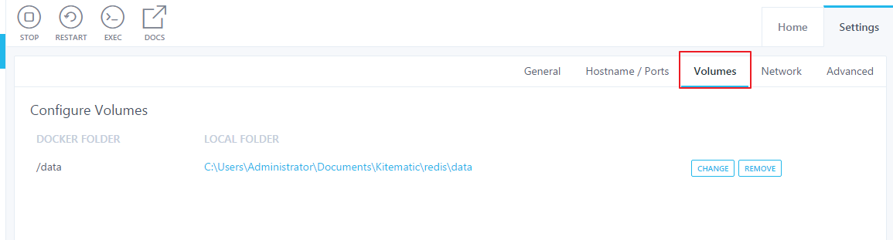

| en                | cn            |
| ----------------- | ------------- |
| Configure Volumes | 配置卷        |
| DOCKER FOLDER     | Docker 文件夹 |
| LOCAL FOLDER      | 本地文件夹    |
| CHANGE            | 更改          |
| REMOVE            | 移除          |

#### Network

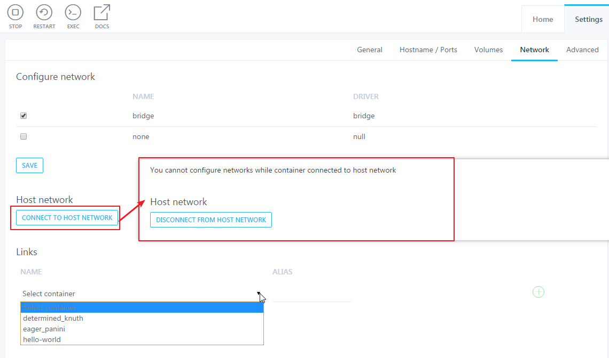

| en                                                           | cn                                     |
| ------------------------------------------------------------ | -------------------------------------- |
| Configure network                                            | 配置网络                               |
| NAME                                                         | 名称                                   |
| DRIVER                                                       | 驱动                                   |
| bridge                                                       | 桥接                                   |
| none                                                         | 无                                     |
| null                                                         | 空                                     |
| SAVE                                                         | 保存                                   |
| Host network                                                 | 主机网络                               |
| CONNECT TO HOST NETWORK                                      | 连接到主机网络                         |
| DISCONNECT FROM HOST NETWORK                                 | 从主机网络断开                         |
| You cannot configure networks while container connected to host network | 当容器连接到主机网络时，您不能配置网络 |
| Links                                                        | 链接                                   |
| NAME                                                         | 名称                                   |
| ALIAS                                                        | 别名                                   |
| Select container                                             | 选择容器                               |
| determined_knuth                                             | 现存的容器                             |
| eager_panini                                                 | 现存的容器                             |
| hello-world                                                  | 现存的容器                             |

#### Advanced

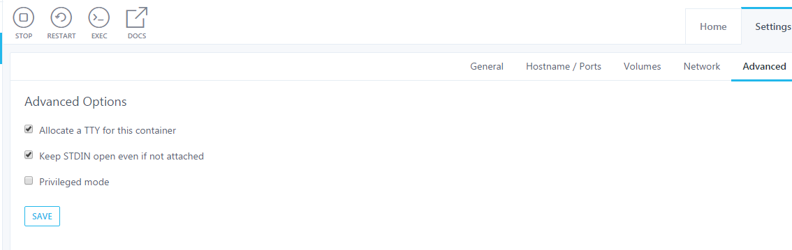

| en                                   | cn                          |
| ------------------------------------ | --------------------------- |
| Advanced Options                     | 高级选项                    |
| Allocate a TTY for this container    | 分配一个TTY为此容器         |
| Keep STDIN open even if not attached | 保持STDIN开放，即使没有连接 |
| Privileged mode                      | 特权模式                    |
| SAVE                                 | 保存                        |

## 报错页

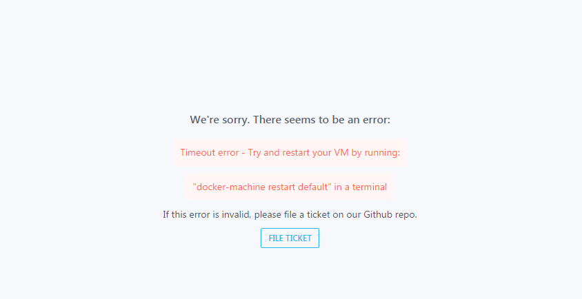

| en                                                           | cn                                                       |
| ------------------------------------------------------------ | -------------------------------------------------------- |
| We’re sorry. There seems to be an error                      | 我们很抱歉。似乎有一个错误                               |
| Timeout error - Try and restart your VM by running           | 超时错误——尝试通过运行重新启动你的虚拟机                 |
| “docker-machine restart default”  in a terminal              | 在终端运行 “docker-machine restart default”              |
| If this error is invalid, please file a ticket on our Github repo. | 如果这个错误是无效的,请提交一份反馈在我们的Github 仓库。 |
| FILE TICKET                                                  | 反馈                                                     |

### 分析

因为Kitematic直接连接到正在运行的Docker实例，并通过Docker Engine API对其进行控制。

所以，当Docker实例不存在或没有运行时，会报此错误。

## 参考阅读

[^1]: 不勾选，则在下次启动时会检查Docker，会出现 Setup Initialization 页面
[^2]: 出现此问题，可能是自带的VirtualBox被替换了。

